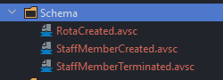
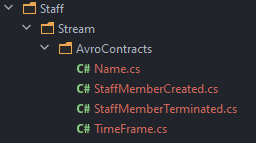

# Kafka 
[](https://codecov.io/gh/NetMaximum/Kafka)

## Todo

* ~~Handling unregistered schemas~~
* ~~Returning ConsumeResult.~~
* Autocommit and manual commit.
* Change Type on ConsumeResult
* Wrap more things with a generic exception.
* Docs for producer and consumer.
* Integration tests fail due to docker services not fully initialised on early runs of End2End tests.
* Create the topic with the correct subject strategy.
* Pass the config in correctly.

## Install the tool (One time)

```
dotnet tool install --global Apache.Avro.Tools --version 1.11.0
```
Allows C# classes to be generated from the Avro schema files.

## Example Usage

During the walk through we'll be using the schema files that can be found in the test project of the package repository. 

### Create a class library

Create a new .NET class library and copy the schema files into a schema folder inside the project:



### Generate classes from schema files - Using the global AvroGen tool, run in the root of the new project
```
avrogen -s .\Schema\StaffMemberCreated.avsc .
avrogen -s .\Schema\RotaCreated.avsc .
avrogen -s .\Schema\StaffMemberTerminated.avsc .
```

This should result in a file structure that resembles:



### Create a base interface

A base interface is needed when producing or consuming messages from a topic, the serializer will deal with creating the correct type.

```
internal interface IStaffMemberEvent : ISpecificRecord
{
}
```

### Extend the auto generated code to use the base interface

```
using Avro.Specific;
using NetMaximum.UnitTest;

namespace NetMaximum.UnitTest
{
    public interface IStaffMemberEvent : ISpecificRecord
    {
    }
}

namespace Staff.Stream.AvroContracts
{
    public partial class StaffMemberCreated : IStaffMemberEvent{}
    public partial class StaffMemberTerminated  : IStaffMemberEvent{}
}

```
Because the created classes via AvroGen are in a different namespace, you need to wrap the partial class declarations with the correct namespace.

### Register the types with the serializer

```
 builder.AddType<StaffMemberCreated>(StaffMemberCreated._SCHEMA);
 builder.AddType<StaffMemberTerminated>(StaffMemberTerminated._SCHEMA);
```